# 갈까요 (Shall We Go)

**갈까요**는 대화를 통해 여행의 계획부터 일정 공유까지 도와주는 AI 에이전트 챗봇입니다. 사용자는 에이전트와의 대화를 통해 여행 장소를 탐색하고, 맞춤형 일정을 세우며, 이를 캘린더에 저장하거나 다른 사람과 공유할 수 있습니다.

## 주요 기능

- 🗺️ **여행 장소 검색**  
  에이전트와 자연스럽게 대화하며 추천 여행지를 탐색할 수 있습니다.

- 📝 **여행 계획서 작성**  
  사용자의 취향과 대화를 바탕으로 여행 계획서를 자동으로 작성합니다.

- 📅 **캘린더 연동**  
  여행 일정을 대화만으로 등록, 조회, 수정, 삭제할 수 있습니다.

그 외 기능은 [docs/phase2/result.md](docs/phase2/result.md) 참고

## 사용한 도구

- 코드 작성, 편집: PyCharm, Cursor.ai
- 코드 어시스턴트: Github Copilot, Cursor.ai
- 검색 및 문서 작성, 합성 데이터 생성: ChatGPT, Claude, Gemini

자세한 내용은 [docs/phase2/ai_tools.md](docs/phase2/ai_tools.md) 참고

## 시연 화면
- 최초 접속 화면 및 카카오 OAuth 로그인 구현
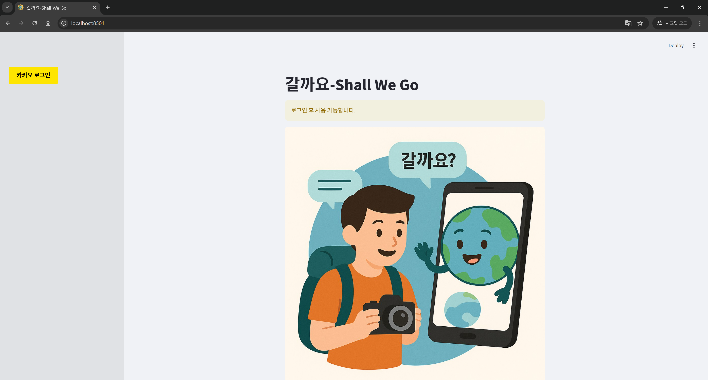
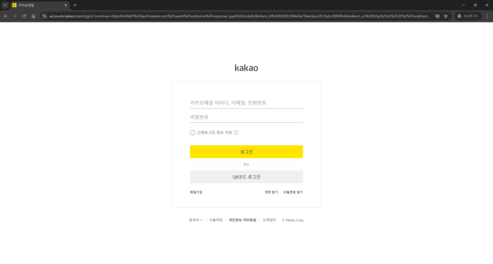
- 로그인 화면. 우측은 채팅 UI이며 좌측은 사이드바. 로그아웃, LLM 모델 선택, 전체 대화 삭제(웹 미포함, DB 내역 삭제)
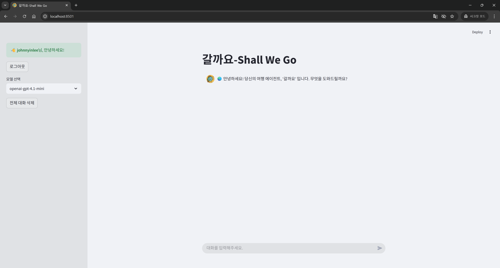
- 검색 및 추천 기능. Daum 검색 API 및 카카오맵 로컬 API 를 활용하여 지역 및 카테고리 기반의 장소 추천
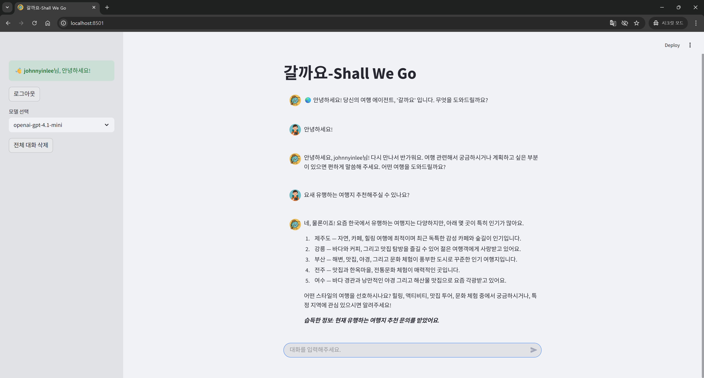
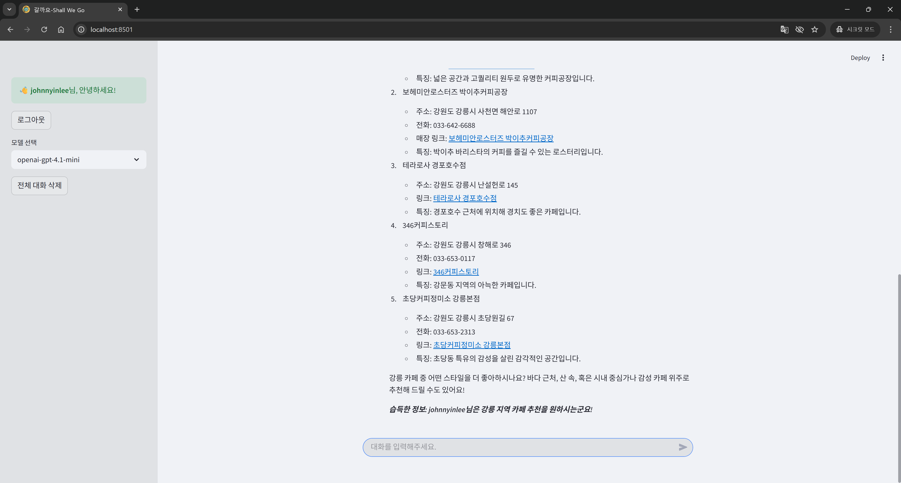
- 대화 기반 여행 계획서 작성.
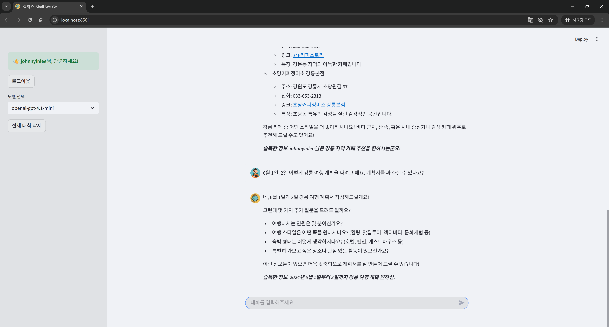
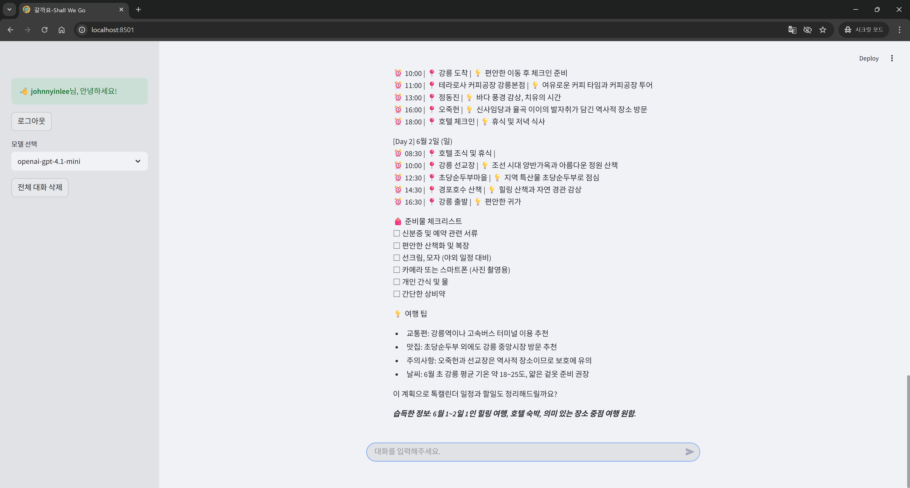
- 카카오 톡캘린더 연동, 에이전트가 직접 캘린더와 일정, 할일 등록
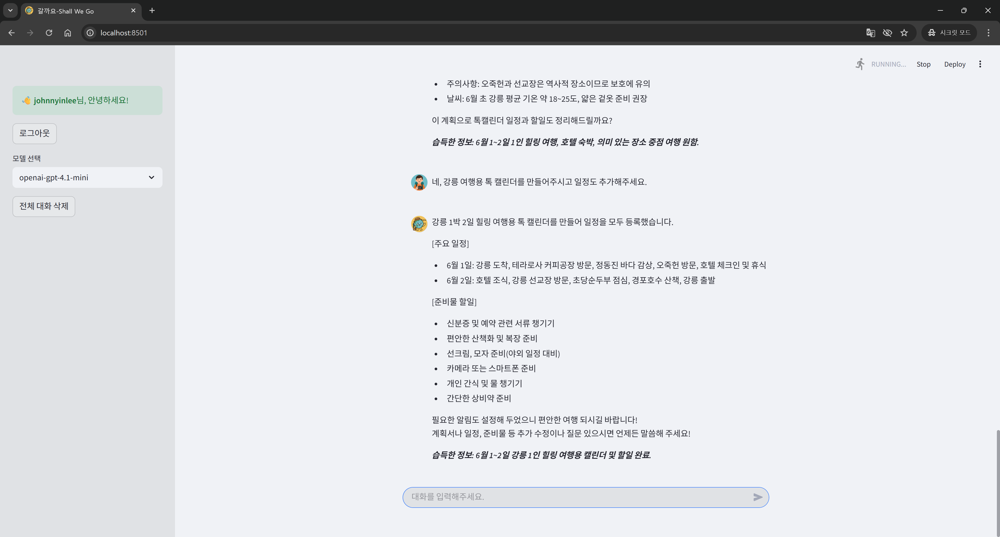
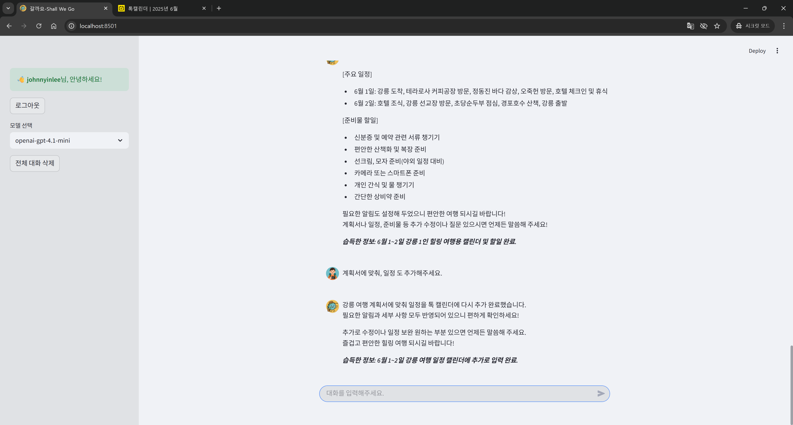
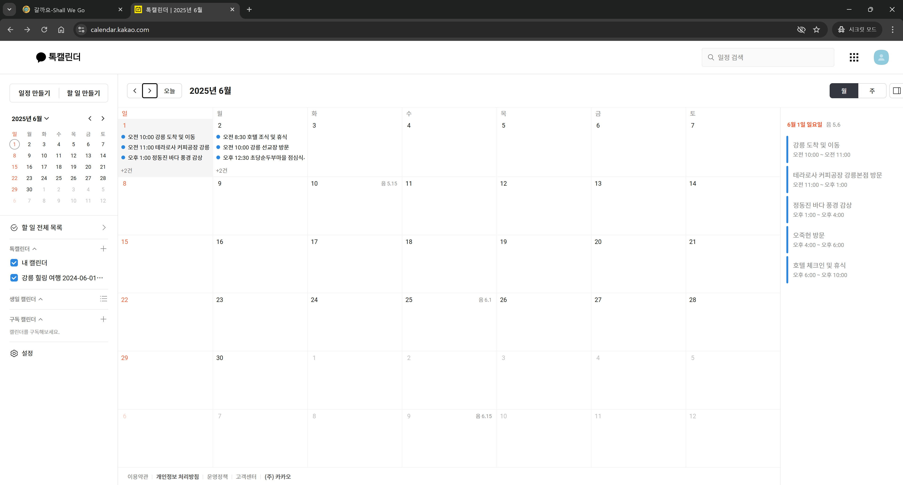
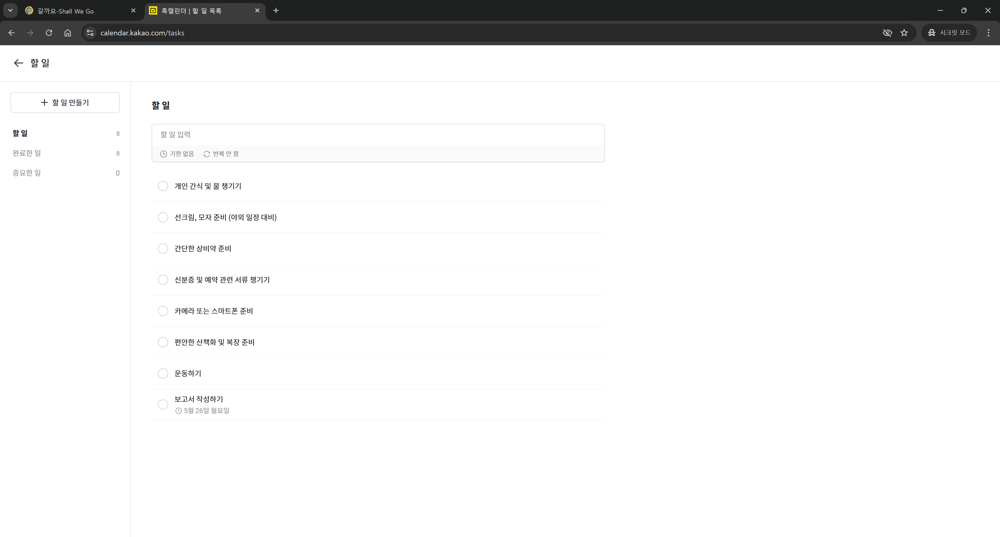

## 프로젝트 구조

```
shallwego/
├── app-fastapi/                 # FastAPI 백엔드 서버
│   ├── agent/                   # LangGraph 에이전트 관련
│   │   ├── agent_graph.py       # 에이전트 그래프 정의
│   │   ├── agent_llm.py         # LLM 모델 설정
│   │   ├── agent_nodes.py       # 에이전트 노드 구현
│   │   ├── agent_state.py       # 에이전트 상태 관리
│   │   └── agent_tools.py       # 에이전트 도구 설정
│   ├── core/                    # 핵심 설정 및 유틸리티
│   ├── crud/                    # 데이터베이스 CRUD 작업
│   ├── data/                    # 데이터 파일
│   ├── models/                  # 데이터베이스 모델
│   ├── routers/                 # API 라우터
│   │   └── chat_router.py       # 채팅 API 엔드포인트
│   ├── schemas/                 # Pydantic 스키마
│   ├── tools/                   # 에이전트 도구 구현
│   │   ├── calendar_tools.py    # 캘린더 연동 도구
│   │   ├── event_tools.py       # 이벤트 관리 도구
│   │   ├── local_tools.py       # 로컬 검색 도구
│   │   ├── search_tools.py      # 검색 도구
│   │   ├── task_tools.py        # 작업 관리 도구
│   │   └── tool_helpers.py      # 도구 헬퍼 함수
│   ├── utils/                   # 유틸리티 함수
│   ├── tests/                   # 테스트 코드
│   ├── main.py                  # FastAPI 애플리케이션 진입점
│   ├── pyproject.toml           # 프로젝트 의존성 관리
│   └── app-fastapi.Dockerfile   # Docker 설정
│
├── app-streamlit/               # Streamlit 프론트엔드
│   ├── page/                    # 페이지 컴포넌트
│   │   ├── chat.py              # 채팅 페이지
│   │   ├── options.py           # 옵션 설정 페이지
│   │   └── social_login.py      # 소셜 로그인 페이지
│   ├── resources/               # 리소스 파일
│   ├── schemas/                 # 데이터 스키마
│   ├── utils/                   # 유틸리티 함수
│   │   ├── api_endpoints.py     # API 엔드포인트 설정
│   │   └── encryption.py        # 암호화 유틸리티
│   ├── dataset/                 # 데이터셋
│   ├── .streamlit/              # Streamlit 설정
│   ├── main.py                  # Streamlit 애플리케이션 진입점
│   ├── pyproject.toml           # 프로젝트 의존성 관리
│   └── app-streamlit.Dockerfile # Docker 설정
│
├── docs/                        # 프로젝트 문서
│   ├── phase1/                  # 1차 개발 문서
│   └── phase2/                  # 2차 개발 문서
├── images/                      # README 이미지 파일
└── README.md                    # 프로젝트 설명서
```

## 사용 기술 및 아키텍처
- 전체 아키텍처

- LangGraph
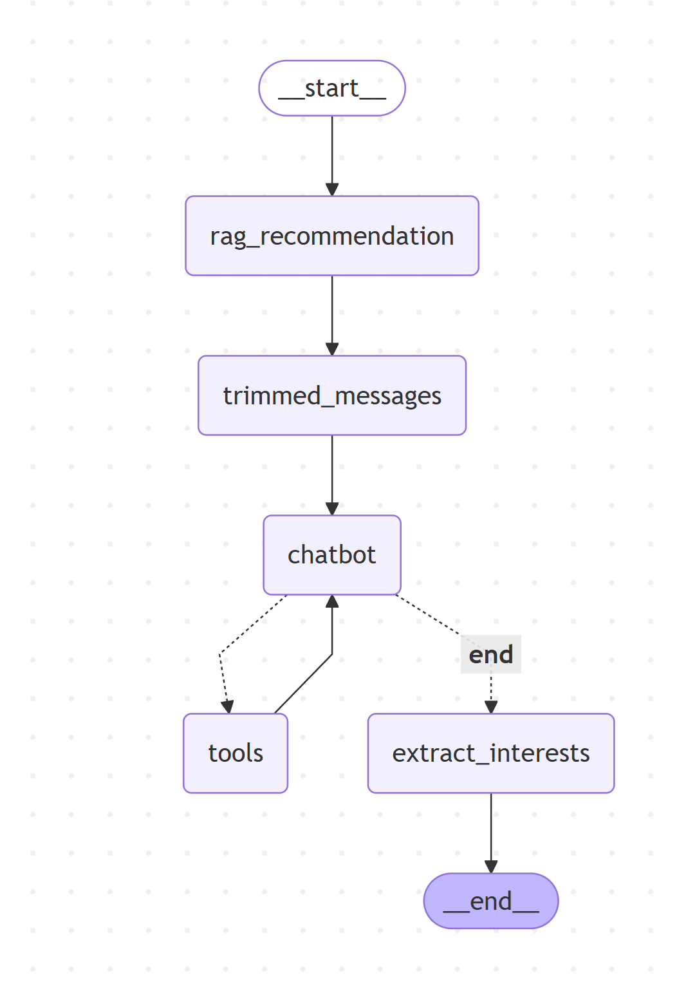
자세한 내용은 phase2/langchain_graph.md 참고

## 일정

- 1차 기능 개발(Phase 1): 5/19-5/23 
- 2차 기능 개발(Phase 2): 5/24-5/25

## 실행 방법

### Docker를 이용한 실행 (권장)

1. **각 애플리케이션 Docker 빌드**
   ```bash
   # FastAPI 백엔드 빌드
   cd app-fastapi
   docker build -f app-fastapi.Dockerfile -t shallwego-backend .
   
   # Streamlit 프론트엔드 빌드
   cd ../app-streamlit
   docker build -f app-streamlit.Dockerfile -t shallwego-frontend .
   ```

2. **필수 설정 파일 작성**
   - `app-fastapi/.env`: 백엔드 환경 변수
   - `app-streamlit/.streamlit/secrets.toml`: Streamlit 시크릿 설정
   - `app-streamlit/utils/api_endpoints.py`: API 엔드포인트 설정

3. **컨테이너 실행**
   ```bash
   # 백엔드 실행 (포트 8000)
   docker run -p 8000:8000 shallwego-backend
   
   # 프론트엔드 실행 (포트 8501)
   docker run -p 8501:8501 shallwego-frontend
   ```

### 로컬 개발 환경 실행

- `uv`를 사용하여 각 디렉토리에서 로컬 실행 가능
- app-streamlit(프론트엔드), app-fastapi(백엔드) 개별 실행 지원

##### 기타 문서는 docs 내 phase1, phase2 폴더 참고

이 문서는 AI 도구(ChatGPT, Claude)로 작성했습니다.