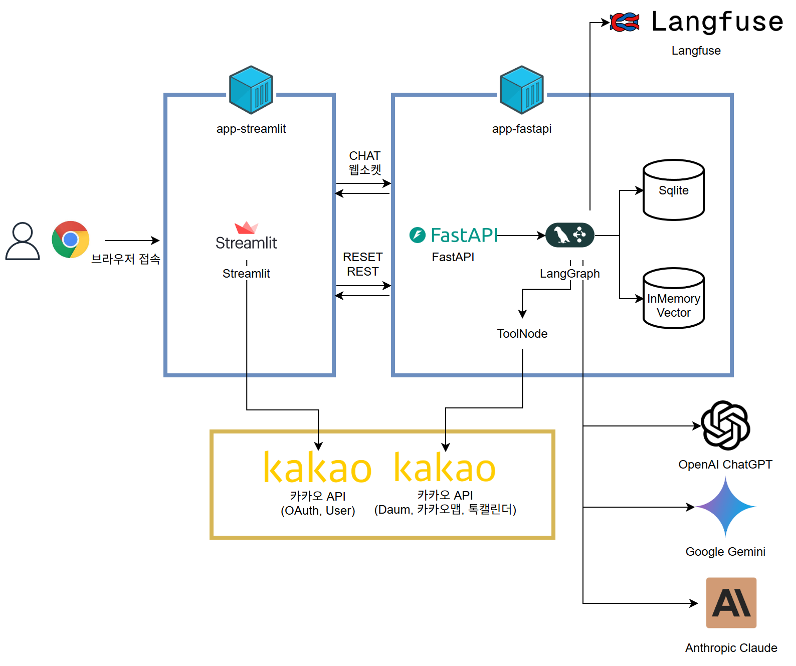

## 사용 기술 및 아키텍처
- 전체 아키텍처

### 1. 사용자 (Browser)
- Chrome 등 웹 브라우저로 접속

### 2. app-streamlit
- **Front-end**: Streamlit
- 채팅 및 로그인 등 사용자 웹 UI 제공
- FastAPI 백엔드 연결
  - **Chat**: WebSocket  
  - **RESET**: REST
- 카카오 API: OAuth, 사용자 정보 

### 3. app-fastapi
- **Back-end**: FastAPI + LangGraph
- **데이터 저장소**  
  - SQLite
  - In-Memory Vector
- **ToolNode**   
  - Daum 검색, 카카오맵, 톡캘린더 연동

### 4. 외부 LLM 서비스
- OpenAI ChatGPT  
- Google Gemini  
- Anthropic Claude

### 5. 추적 및 모니터링 서비스
- Langfuse

### 6. 확장성 및 운영

- 스트림릿과 FastAPI 분리 → **부하가 큰 쪽만** 독립적으로 스케일 아웃 가능  
- 다양한 LLM 모델을 활용 가능하도록 설계 → 빠른 발전 속도에도 유연한 대응 가능 
- SQLite / InMemory Vector → PostgreSQL + pgvector, 전용 벡터 DB(Pinecone, Weaviate 등)로 **교체 또는 확장**  
- Grafana / Prometheus / EKS 등 **모니터링·오케스트레이션** 도구 연동 가능