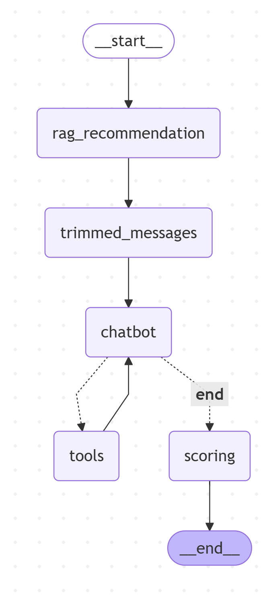

- rag_recommendation: 합성 데이터를 통한 임베딩 데이터 구축, RAG 기법 + 시멘틱 서치를 통해 관광지 데이터 첨부
- trimmed_messages: 지나치게 대화가 길어질 경우 메시지를 자르고 중간 요약하는 기법 추가
- chatbot: LLM 챗봇. ToolNode를 사용하거나 답변 진행.
- tools: 아래의 툴을 묶은 ToolNode
tools = [
    daum_web_search, # 웹 검색 도구
    get_calendar_list, create_calendar, update_calendar, delete_calendar, get_holidays, # 캘린더 API
    create_event, get_event_list, get_event_detail, update_event, delete_event, # 일정 API
    create_task, get_tasks, records_task, update_task, complete_task, delete_task, # 할 일 API
    search_places_by_keyword, search_places_by_category, # 장소 검색 도구
]
- scoring: 챗봇이 자신이 나눈 메시지를 기반으로 0~100점 스코어링

